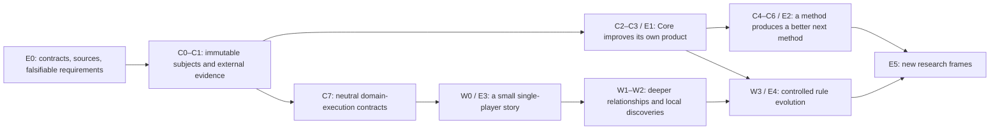

# From ambition to a sequence of evidence

<!-- translation-metadata:start -->

Translation source and currency

Translation source: [delivery-plan.md](delivery-plan.md). Source SHA-256 (UTF-8/LF): `7d3e731a805dce8163e8b8522f1fbbd830f96895c262c0ceda08ae3b8d140b72`.

Currency checks: [Core](https://github.com/HappyMiha/Lokvetia-Core/actions/workflows/planning.yml?query=branch%3Amain) · [Lokiravia](https://github.com/HappyMiha/Lokiravia/actions/workflows/planning.yml?query=branch%3Amain). English is a documentation translation; canonical requirements and evidence statuses are unchanged.

<!-- translation-metadata:end -->

Українська: [original](delivery-plan.md).

**Current order and delivery boundaries:** [280 consolidated requirements](implementation-order.en.md) and [first releases](first-releases.en.md). They refine sequencing and allocation for this conceptual plan; canonical IDs, dependencies, and old gates are preserved. Where release scope differs in detail, use first-releases.

Shared Lokvetia Core / Lokiravia plan · 2026-09-09 · proposed. This is an order for testing hypotheses and future work, not a calendar commitment or permission to begin implementation. The current delivery is E0 documentation.

## 1. Portfolio and reading rules

The new portfolio contains 35 `core:AF-RSI-*` and 30 `cloud:AF-LW-*` items. The historical `cloud` prefix denotes the Lokiravia repository. The new JSON files have their own `portfolio_schema_version: 1`, `artifact_kind: design_backlog`, and `not_runtime_import: true`. They must not be passed to the existing schema v2 execution importer. Active manifests, statuses, and milestone gates are unchanged.

Cards containing outcomes and criteria are edited in `backlog.md`; `backlog.json` is a structured representation of the same cards, with qualified dependencies, reuse, work type, phase, and sources. A card change requires both files to be checked together. An `existing_work_refs` entry identifies an integration point, not a dependency that has already been completed. Actual readiness is determined by accepted artifacts at the exact revision.

**C0–C8** are Core phases, **W0–W4** are world phases, and **E0–E5** describe the strength of product evidence. P0 priority applies within a phase. Relative M/L values in JSON are initial, low-confidence complexity estimates; they are neither person-days nor a cost estimate. Implementation dates and costs are set only after technical trials and team capacity are known.

## 2. Critical sequence

Arrows show evidence dependencies; they do not require completing every task in a phase before starting the next. Detailed prerequisites are specified by the combined DAG of the two JSON files. The general-purpose platform does not wait for a finished game; a game proof can use a separately qualified thin Core contract without completing the entire recursion.

| Slice | What must be obtained | Cards / dependencies | What it does not yet prove |
|---|---|---|---|
| Contract foundation | Authority boundaries, versions, protocol, and evidence provenance | AF-RSI-001–006, then comparator/budget/arena 007–009 | Product improvement |
| First full Core-on-Core gate 019 | At least one own-harness change and one source change; measured benefit under the protocol, a failed candidate, persistence, and recovery. Proof of one mutation is an early slice, not full019 | AF-RSI-010–019 with transitive dependencies | Recursive method improvement or benefit for any arbitrary task |
| Narrow world | One original adventure, causal and control walkthroughs, save/load, human experience | AF-LW-030 and its closure; Core 031–033 and their prerequisites | Self-modifying rules, multiplayer, a large-world economy |
| Recursive method proof | O0 creates O1; separately accepted O1 creates method O2; benefit is confirmed on new tasks | AF-RSI-020–024, 029–030 and dependencies | Unbounded RSI or automatic value from a new objective |
| Live rule change | A world-rule candidate, consistent migration, versioned history, rollback, and another playtest | Core034; AF-LW-023–028 and prerequisites | Massively multiplayer online game readiness |
| Longer-term research | Testing a new direction, new evaluator, training, or networked collaboration | Core027–028/035, World029; existing engine/platform gates | An obligation to implement every hypothesis |

[Q04 training research](training-research.en.md) specifies Core035 as a feasibility/admission/adoption design. Admission to a future bounded pilot depends on rights, actual resources, and a suitable protocol; adoption depends on later measured product evidence. The current documentation starts no training.

Standalone Core acceptance covers 001–030. Domain adapters 031–034 and training research 035 are outside that gate. Existing consumer profiles undergo contract checks; completing AF-CLD-020 or a future game does not become a requirement for accepting Core.

## 3. Exact boundary of the first game

AF-LW-030 has 11 transitive world prerequisites: **001, 002, 003, 004, 005, 008, 009, 010, 011, 012, 014**. Together they form 12 W0 cards. Direct and transitive Core contracts are counted separately in the DAG; “narrow” does not conceal their cost.

First proof: one player, a small location, at least two NPCs with their own intentions, an object with verifiable properties, an unusual use, a local result, a possible continuation when the conditions exist, and saving. Humor is tested through action and reaction, not the number of lines. The full “The Town That Owes You a Favour” scenario gives the creator broader material; the first build can be limited to a bench and two NPCs, with the office and the rest of the district added after proof.

AF-LW-006/007, a full economy, institutions, every type of absurd profession, ontology evolution, rule canaries, online co-op, and the whole district are outside W0. Object-safety and recovery criteria exist in W0; full production rollback for world evolution appears in W3. A paper or scripted demonstration tests clarity and contracts but is not declared an emergent AI world.

Three control walkthroughs separate the claims: (a) the same action in the same state produces the same local physical effect; (b) without compatible schedules, the larger consequence does not occur; (c) another appropriate action can lead to a similar social opportunity. A counterfactual branch retains its own seed and baseline and does not rewrite lived history. A long-term failed plan is a separate observable branch; the absence of a reward must not conceal causes.

## 4. Coexistence with existing products

| Existing direction | Relationship to the evolution portfolio | Integration condition |
|---|---|---|
| Core AF-008 engineering loop | Bounded candidate execution for RSI011 | Repeating one task is not called generation evolution |
| Core AF-020 evaluation; AF-051/052 delivery validation | RSI004/006/007 bind sealed receipts to the exact candidate and protocol | An `accepted_evidence` boolean alone is insufficient; a domain producer needs an explicit adapter |
| Core AF-016 memory/skills; AF-024 packs | RSI012/013, domain adapters | Skill draft, admission verdict, versioned pack, and revocation lineage; no invented existing quarantine enum |
| Core GC M0→M3 | Existing game-creator infrastructure gates are retained | A new architecture document does not move them to done |
| Lokiravia CLD007–019 | Target path: brief → small version → Godot → checks → Play → feedback → v2/restore | W0 consumes accepted starter/adapter/checkpoint/Play contracts; it does not create a second build pipeline |
| Lokiravia AF-CLD-020 | The first creator product is tested on three real games | One living-world story may be one piece of evidence; it does not replace all three games, Windows/export, feedback/v2/restore, and the owner test |
| Lokiravia AF-CLD-034 and later | Hosted private alpha and later engine/release gates | A local game does not prove hosted isolation, storage, quotas, or publishability |
| Lokiravia AF-CLD-054/060 | Unreal and the multi-engine horizon | Neutral action/replay/proposal contracts are preserved; the initial proof remains Godot 2D |

Q07 rechecked the actual dependency; the intake guide contains a different, older pin (details in the [creator audit](creator-evolution.en.md)). Current consumer Core pin: `480849f78957bb6b2fd7ab341300d54955aeabb8`. New contracts/adapters are not considered available merely because Core HEAD is newer. Upstream build qualification, exact compatibility receipts, consumer upgrade, and fallback to the previous version are a separate transition described in the [shared contract](platform-world-contract.en.md).

## 5. Improving the Lokiravia creator product

World feedback and a creator's problem are different signals. A creator may want a peaceful game and receive an attractive report, while Play fails to open the required version. Lokiravia owns the initial brief, agreed scope, exact build, and a clear change/recovery path. Core provides reusable experiment machinery and can improve its own context-selection source/harness. A change only to a quest or the Cloud UI is not evidence of Core self-improvement.

The [Q07 creator contract](creator-evolution.en.md) checked the actual local path saved brief→scope→agreement→Core team gap assessment. The Build/Play/feedback/restore handoff still needs qualification. Therefore, the first **planning study** checks saved/unsaved state, clear scope tradeoffs, planned fidelity commitments, and the blocked next step. Planned scope fidelity is not evidence of realized behavior in the future game. Two small scope alternatives are a challenger design, not an existing feature. Time to a finished game is not calculated for this study.

The **end-to-end creator comparison** relies on existing CLD007/008/015/017/018/020 and is admitted after actual qualification of the exact baseline/challenger build/Play/change/restore bundles. Before the run, choose the primary axis: independent completion, or less effort with non-inferior realized fidelity of the exact build. Floors: exclusions are visible and agreed; the correct played/feedback/target version is used; restore creates a new version/audit record while preserving the original evidence binding and ends with a usable target receipt; authority and full cost are preserved. Template approval, a generic commit, a history view, and paper Play do not pass these gates.

Pilot plan: 8–12 creators with short briefs, order/learning-carryover control, task comparability, and separate recording of assistance, active/wall/wait time, refusals, and costs. This is qualitative problem discovery with people, not a completed session or a statistical-power calculation. Denominators and missingness are bounded by the permitted collection scope. Less effort achieved through an unagreed simplification of the idea is rejected; changed scope/audience/need requires a new versioned hypothesis, not relabeling an old failure.

Q07 supplies six paper-walkthrough steps and ten public controls. W0 can be a manually authored Godot scene and does not wait for a universal creator generator. Core030 is still accepted separately on non-game families; the next Q08 defines their task/holdout protocol.

## 6. Evidence, resources, and stopping criteria

| Unknown | Cheapest meaningful check | What will change the decision |
|---|---|---|
| Is there real Core improvement? | Preregistered paired baseline/challenger comparison on independent tasks | Superiority on the primary axis + non-inferiority floors, full search cost, fresh confirmation |
| Is the method better, rather than memory supplying the answer? | Equal-budget control, new task families, separate memory ablation | Typed O0→O1→O2 and measured transferability; uncertainty remains inconclusive |
| Does the game provide agency and understandable consequences? | Paper scenario, then 12 facilitated single-player sessions | People describe causality and their own decisions; not every walkthrough must have a cascade |
| Does the humor work? | The same mechanic with and without contextual reactions | Participants' original accounts, appropriateness, and absence of fatigue; a judge score is insufficient |
| Does evolution pay off? | Account for inference, failures, verifier, storage, operator time, and maintenance | The gain in useful outcomes exceeds the preaccepted cost; more tokens do not count as progress |
| Will a new rule damage the world? | Old-save migration, no-op control, replay, revoked candidate, interrupted activation | Compatibility and recovery plus human assessment of the new experience; a successful test alone is insufficient |

The Q08 [non-game protocol](non-game-evaluation.en.md) specifies 60 root-task pairs as an initial confirmation-block hypothesis across two families, not six measurements of one task. Separate D/S preparation and search runs count toward the budget. That number and the 12 players in the world pilot are initial design assumptions. A quantitative claim requires a variance estimate, power/precision assessment, and a suitable analysis plan beforehand. Reusing a holdout for candidate selection turns it into a dev set; a final claim needs a new independent check. Do not buy statistical significance with unlimited attempts.

Every cycle has budgets for time, attempts, inference, human review, and permitted external effects. Two consecutive informative no-gain cycles are a proposed trigger to revisit the hypothesis, not an instruction to prove success on a third attempt. Extra budget is a separate decision made before new runs. Absence of an independent signal stops acceptance; it does not forbid documenting a candidate as unverified.

## 7. Decisions before implementation

Responsibility describes roles, not computers or separate work registries. The product owner accepts the problem/experience hypothesis. The platform architect accepts contract boundaries. The evaluation lead fixes the comparison method. The game designer owns rule fairness and authorial character. An independent reviewer checks claims and evidence. One person may hold several roles, but conflicts of interest and evidence provenance must be explicit.

Before implementation, decisions are needed on the supported local runtime profile, available resources, actual source/root corpora for the proposed Q08 non-game families, independent evaluation, and how to recruit creators/players. These do not block documentation work. No literature review or current benchmark replaces a future experiment on these products.

Next passes are described in the [research queue](continuation.en.md). A new pass must change a decision, criterion, dependency, or source confidence. Text volume alone is not an outcome.
