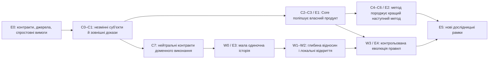

# Від амбіції до послідовності доказів

Спільний план Lokvetia Core / Lokiravia · 2026-09-09 · proposed. Це порядок перевірки гіпотез і майбутніх робіт, а не календарне зобов’язання або дозвіл почати реалізацію. Поточна поставка — документація E0.

## 1. Портфель і правила читання

Новий портфель містить 35 `core:AF-RSI-*` і 30 `cloud:AF-LW-*`. Історичний префікс `cloud` означає репозиторій Lokiravia. Нові JSON мають власний `portfolio_schema_version: 1`, `artifact_kind: design_backlog` і `not_runtime_import: true`. Їх не передають чинному виконувальному імпортеру schema v2. Активні manifest, статуси й milestone gates не змінюються.

Картки з результатом і критеріями редагують у `backlog.md`; `backlog.json` — структуроване представлення тих самих карток із кваліфікованими залежностями, reuse, типом роботи, фазою та джерелами. Зміна картки вимагає синхронної перевірки обох файлів. Запис `existing_work_refs` означає місце інтеграції, а не залежність, яку вже виконано. Реальна готовність визначається прийнятими артефактами exact revision.

**C0–C8** — фази Core, **W0–W4** — фази світу, **E0–E5** — сила продуктового доказу. Пріоритет P0 діє всередині фази. Відносні M/L у JSON — початкова складність з низькою впевненістю; це не людино-дні й не кошторис. Дати реалізації та витрати фіксуються лише після технічних проб і відомої місткості команди.

## 2. Критична послідовність

Стрілки показують залежність доказів, не вимагають завершити всі задачі фази до початку наступної. Детальні prerequisites задає об’єднаний DAG двох JSON. Універсальна платформа не чекає готової гри; ігровий proof може використовувати окремо кваліфікований тонкий контракт Core без завершення всієї рекурсії.

| Зріз | Що має бути отримано | Картки / залежності | Чого ще не доводить |
|---|---|---|---|
| Контрактний фундамент | Межі влади, версії, протокол і походження evidence | AF-RSI-001–006, далі comparator/budget/arena 007–009 | Покращення продукту |
| Перший повний Core-on-Core gate019 | Принаймні одна зміна власного harness і одна source-зміна; measured benefit за protocol, failed candidate, persistence й recovery. Proof однієї mutation — ранній зріз, не повне019 | AF-RSI-010–019 з транзитивними залежностями | Recursive method improvement або користь для будь-якої задачі |
| Вузький світ | Одна оригінальна пригода, причинний і контрольний прохід, save/load, досвід людей | AF-LW-030 та його замикання; Core 031–033 та їхні prerequisites | Самозміну правил, multiplayer, економіку великого світу |
| Recursive method proof | O0 створює O1; окремо прийнятий O1 створює метод O2; користь підтверджена на нових задачах | AF-RSI-020–024, 029–030 і залежності | Необмежену RSI або автоматичну цінність нової мети |
| Жива зміна правил | Кандидат world-rule, несуперечлива міграція, версійована історія, rollback і повторний playtest | Core034; AF-LW-023–028 та prerequisites | Готовність масової онлайн-гри |
| Далекі дослідження | Перевірка нового напряму, нового evaluator, training або мережевої співпраці | Core027–028/035, World029; чинні engine/platform gates | Обов’язок реалізувати кожну гіпотезу |

[Q04 training research](training-research.md) конкретизує Core035 як feasibility/admission/adoption design. Допуск майбутнього bounded pilot спирається на права, реальні ресурси й придатний протокол, а adoption — на пізніше measured product evidence. Поточна документація жодного training не запускає.

Standalone acceptance Core охоплює 001–030. Доменні adapters 031–034 і training research035 до цього gate не входять. Наявні consumer profiles проходять контрактні перевірки; завершення AF-CLD-020 або майбутньої гри не стає вимогою прийняти Core.

## 3. Точна межа першої гри

AF-LW-030 має 11 транзитивних світових prerequisites: **001, 002, 003, 004, 005, 008, 009, 010, 011, 012, 014**. Разом це 12 карток W0. Прямі й транзитивні Core-контракти рахуються окремо в DAG; слово «вузький» не приховує їхньої вартості.

Перший доказ: один гравець, невелике місце, щонайменше два NPC з власними намірами, предмет із перевірними властивостями, незвичне застосування, локальний результат, можливе продовження за наявності умов, збереження. Гумор перевіряємо через дію та реакцію, не кількість реплік. Повний сценарій «Місто, яке винне тобі послугу» дає авторові ширший матеріал; перший build може обмежитися лавкою й двома NPC, а канцелярію та решту району додавати після доказу.

AF-LW-006/007, повна економіка, інституції, усі типи абсурдних професій, ontology evolution, rule canary, онлайн-кооперація та весь район не входять до W0. Критерії безпеки предметів і відновлення існують у W0; повний production rollback для еволюції світу з’являється в W3. Паперова або scripted демонстрація перевіряє зрозумілість і контракти, але не оголошується emergent AI world.

Три контрольні проходи розділяють claims: (a) та сама дія за однакового стану дає той самий локальний фізичний ефект; (b) без сумісних розкладів великий наслідок не виникає; (c) інша доречна дія може привести до подібної суспільної можливості. Контрфактична гілка зберігає власний seed і baseline, не переписує прожиту історію. Довгий невдалий план — окрема спостережувана гілка; відсутність винагороди не має приховувати причин.

## 4. Як це співіснує з чинними продуктами

| Наявний напрям | Зв’язок з еволюційним портфелем | Умова інтеграції |
|---|---|---|
| Core AF-008 engineering loop | Кандидатне bounded виконання для RSI011 | Повторне виконання однієї задачі не називається generation evolution |
| Core AF-020 evaluation; AF-051/052 delivery validation | RSI004/006/007 перев’язують sealed receipts із точним candidate і protocol | `accepted_evidence` boolean сам по собі недостатній; domain producer потребує явного adapter |
| Core AF-016 memory/skills; AF-024 packs | RSI012/013, domain adapters | Draft skill, admission verdict, versioned pack та revocation lineage; не вигаданий existing quarantine enum |
| Core GC M0→M3 | Зберігаються існуючі game-creator infrastructure gates | Новий архітектурний документ не переводить їх у done |
| Lokiravia CLD007–019 | Цільовий шлях: brief → мала версія → Godot → checks → Play → feedback → v2/restore | W0 споживає прийняті starter/adapter/checkpoint/Play контракти; не створює другий build pipeline |
| Lokiravia AF-CLD-020 | Перший creator-продукт перевіряється на трьох реальних іграх | Одна living-world історія може бути одним із доказів; не замінює всі три, Windows/export, feedback/v2/restore і owner test |
| Lokiravia AF-CLD-034 та наступні | Hosted private alpha і дальші engine/release gates | Локальна гра не доводить hosted isolation, storage, quotas або publishability |
| Lokiravia AF-CLD-054/060 | Unreal та multi-engine горизонт | Нейтральні action/replay/proposal contracts зберігаються; стартовий доказ лишається Godot 2D |

Q07 повторно звірив actual dependency; intake guide містить старий інший pin (деталі в [creator audit](creator-evolution.md)). Current consumer pin Core `480849f78957bb6b2fd7ab341300d54955aeabb8`. Нові contract/adapters не вважаються доступними через те, що Core HEAD новіший. Upstream build qualification, exact compatibility receipts, consumer upgrade і fallback на попередню версію — окремий перехід, описаний у [спільному контракті](platform-world-contract.md).

## 5. Покращення creator-продукту Lokiravia

Світовий feedback та проблема автора — різні сигнали. Автор може хотіти мирну гру й отримати красивий звіт, але Play не відкриває потрібну версію. Lokiravia відповідає за початковий brief, погоджений зміст, exact build і зрозумілий шлях зміни/відновлення. Core надає reusable experiment machinery та може поліпшувати власний context-selection source/harness. Зміна тільки квесту або Cloud UI не є доказом самовдосконалення Core.

[Q07 creator contract](creator-evolution.md) звірив фактичний local шлях saved brief→scope→agreement→Core team gap assessment. Build/Play/feedback/restore handoff ще потребує qualification. Тому перший **planning study** перевіряє saved/unsaved state, зрозумілі scope tradeoffs, planned fidelity commitments і blocked next step. Planned відповідність scope не є доказом realized поведінки майбутньої гри. Дві малі альтернативи scope — challenger design, не наявна функція. Для такого study не обчислюється час до готової гри.

**End-to-end creator comparison** спирається на чинні CLD007/008/015/017/018/020 та допускається після actual qualification exact baseline/challenger build/Play/change/restore bundles. До запуску обирається primary вісь: independent completion або менші зусилля за не гіршої realized fidelity exact build. Floors: exclusions видимі й погоджені, правильний played/feedback/target version, restore створює нову version/audit record зі збереженням original evidence binding і завершується usable target receipt, authority і повна ціна збережені. Template approval, generic commit, history view та паперовий Play не проходять ці gates.

Пілотний план: 8–12 авторів із короткими briefs, контроль порядку/learning carryover, зіставність tasks, окремий запис assistance, active/wall/wait time, відмов і витрат. Це якісний пошук проблем за участі людей, не виконана сесія або розрахунок статистичної потужності. Деномінатори й missingness обмежені дозволеним обсягом збору. Менші зусилля через непогоджене спрощення задуму відхиляються; scope/аудиторія/потреба, що змінилися, потребують нової versioned hypothesis, не перейменування старого провалу.

Q07 дає шість кроків паперового проходу та десять відкритих controls. W0 може бути вручну заданою Godot-сценою й не чекає універсального creator generator. Core030 як і раніше приймається окремо на non-game families; наступний Q08 визначає їхній task/holdout protocol.

## 6. Докази, ресурси й критерії зупинки

| Невідоме | Найдешевша змістовна перевірка | Що змінить рішення |
|---|---|---|
| Чи є реальне Core improvement? | Preregistered paired baseline/challenger на незалежних задачах | Superiority по primary axis + non-inferiority floors, повна вартість пошуку, fresh confirmation |
| Чи метод кращий, а не пам’ять підказала відповідь? | Equal-budget control, нові сімейства задач, окремий memory ablation | Типізований O0→O1→O2 і виміряна переносимість; невизначеність лишається inconclusive |
| Чи гра дає свободу й зрозумілі наслідки? | Паперовий сценарій, потім 12 фасилітованих single-player сесій | Люди описують причинність і власне рішення; не всі проходи мають cascade |
| Чи гумор працює? | Одна і та сама механіка з контекстними реакціями й без них | Оригінальні розповіді учасників, доречність і відсутність втоми; judge score недостатній |
| Чи еволюція окупається? | Облік inference, невдач, verifier, storage, операторського часу й підтримки | Приріст корисного результату перевищує наперед прийняту ціну; більше токенів не рахується прогресом |
| Чи нове правило не зруйнує світ? | Old-save migration, no-op control, replay, revoked candidate, interrupted activation | Сумісність і recovery плюс людська оцінка нового досвіду; один лише успішний тест недостатній |

Q08 [non-game protocol](non-game-evaluation.md) уточнює 60 root-task pairs як початкову гіпотезу confirmation block у двох families, не шість вимірів однієї задачі. Окремі D/S preparation та search runs входять у budget. Це число й 12 гравців у world pilot — стартові проєктні припущення. Перед кількісним claim потрібні оцінка дисперсії, потужності/точності та відповідний план аналізу. Повторне використання holdout для вибору кандидатів перетворює його на dev-set; для фінального claim потрібна нова незалежна перевірка. Не купувати статистичну значущість необмеженою кількістю спроб.

Кожен цикл має budget на час, спроби, inference, human review і допустимі зовнішні ефекти. Два поспіль інформативні no-gain цикли — запропонований trigger переглянути гіпотезу, не команда довести успіх третьою спробою. Додатковий бюджет — окреме рішення до нових запусків. Відсутність незалежного сигналу зупиняє прийняття; вона не забороняє документувати кандидата як неперевірений.

## 7. Рішення до реалізації

Відповідальність описує ролі, а не комп’ютери чи окремі робочі реєстри. Product owner приймає problem/experience hypothesis. Platform architect приймає contract boundaries. Evaluation lead фіксує метод порівняння. Game designer відповідає за чесність правила й авторський характер. Незалежний reviewer перевіряє claims та evidence. Одна людина може виконувати кілька ролей, але конфлікт інтересів і походження доказів мають бути явними.

До реалізації потрібні рішення про підтримуваний локальний runtime профіль, доступні resources, реальні source/root corpora запропонованих Q08 non-game families, independent evaluation і спосіб залучення авторів/гравців. Вони не блокують документаційну розробку. Жоден огляд літератури або сучасний benchmark не замінює майбутній експеримент на цих продуктах.

Наступні проходи описано у [черзі дослідження](continuation.md). Новий прохід повинен змінити рішення, критерій, залежність або джерельну впевненість. Обсяг тексту сам по собі не є результатом.
