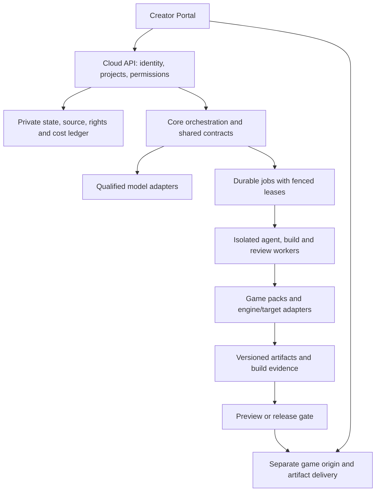

# Lokiravia product description

**Date:** 2026-09-06

**Brand revision:** 2026-09-08. **Lokiravia, by Lokvetia** replaces the public
name AgentFactory Cloud. The product domain is [lokiravia.com](https://lokiravia.com);
[lokvetia.com](https://lokvetia.com) is the family brand domain. Domain ownership
does not establish hosted product availability.

**Status:** Product direction with early local editor and planning components. Hosted game creation and the Unreal path still need qualification. The live shared task register records engineering progress; this description states the intended product and its acceptance boundaries.

## 1. What we want to build

Lokiravia will help people turn a game idea into a real game project. A creator will describe an idea, agree on a small first version, let an AI team build and test it, play the result, and ask for changes.

The creator should receive the source project and supported game builds. A game should remain usable outside Lokiravia, subject to its engine, asset and other license terms.

**Product promise to prove:** Describe a game. Build a small playable version. Keep the source. Improve it through play and feedback.

The wider creation loop is:

**Play → Remix → Create → Publish → Play**

Remix means making a new project from a specific source version that permits this use. It does not mean copying any game found online.

The first goal is a reliable small Godot game. More complex games, other engines, a marketplace and an open factory ecosystem come later. “Almost any complexity” is a long-term direction, not a first-release guarantee.

### Unreal creation and AI inside the game

The planned Unreal path has three parts. Core coordinates the AI team, task ownership, models, budget and recovery. An optional Unreal adapter uses a qualified existing MCP backend to open the editor, write code, build levels, test and package the project. Gameplay AI gives the shipped game bounded NPC actions, memory and world behavior. These parts share explicit contracts and have separate tests.

The first full proof is one level, three NPCs and one objective, packaged for Windows and played without Unreal Editor. It must preserve memory through save/load, remain playable when AI is disconnected, and produce a second accepted package after creator feedback while retaining the first build. The [Unreal and Gameplay AI plan](unreal-gameplay-plan.md) defines the architecture, parallel delivery slices and novice-creator trial. Temporal belongs to durable development/hosted jobs; the first game package does not require Temporal Server.

## 2. Two repositories

| Project | Purpose | Repository |
| --- | --- | --- |
| Lokvetia Core | Open-source, provider-neutral agent orchestration and shared execution contracts | [HappyMiha/Lokvetia-Core](https://github.com/HappyMiha/Lokvetia-Core) |
| Lokiravia | Commercial game creation, hosting, publishing and distribution product built on Core | [HappyMiha/Lokiravia](https://github.com/HappyMiha/Lokiravia) |

The public family brand is **Lokvetia**. **Core** means Lokvetia Core; **Cloud**
remains an internal architecture and task-scope shorthand for Lokiravia.
Existing AF task IDs, Python names and stored data are compatibility identifiers,
as described in the [migration guide](../README.md#compatibility).

The existing Core repository uses Apache-2.0. It must remain useful without a Cloud account, game engine or Cloud billing system. Changes to its public contract should follow an explicit design and migration decision.

**Games**, **Community** and **Marketplace** are logical modules in Cloud. They do not require extra repositories now. The [Core/Cloud responsibility contract](core-cloud-boundary.md) defines the shared vocabulary, sole decision owners, required rights/provenance fields, and game/non-game walkthroughs for AF-CLD-001.

- Games owns the creator's Game Brief experience, product settings, play feedback and asset/release policies. It configures and uses the optional Core packs and adapters instead of duplicating them.
- Marketplace later adds listings, purchases, license products, buyer access and seller payouts.
- Core owns generic contracts for workers, evidence, artifacts and adapters. Optional open-source game packs, studio-role reference packs, concrete engine adapters and build-target packs also belong in the Core repository, outside its neutral scheduler.
- Engine-specific behavior lives in those optional packs. Godot-specific branches do not belong in the Core scheduler; a Core user who does not create games should not need a game engine.
- Cloud can use Core's generic checkpoint or fork contract. Cloud owns whether a user is allowed to Remix, publish or sell a particular version.

This is the planned ownership map. It does not claim that every pack or adapter exists today. The AF-GC bridge must identify what is verified, what needs extension and what remains to be built, with one implementation owner for each capability.

Cloud's commercial code and product operations remain separate from the public Core license. The owner still needs to choose Cloud license terms, contribution terms and any future public components. This planning package does not change those terms.

## 3. What exists and what is still a claim

| Item | Current evidence |
| --- | --- |
| Core repository and software foundation | Existing repository; reuse candidates require a capability review against the new product |
| Earlier Game Creator plan | 42 stable AF-GC task IDs; these remain upstream work, not completed capability claims |
| Cloud product plan | Owner-supplied package, revised into this English description and roadmap |
| Server | The owner reports that a server is available; capacity, isolation and the full game pipeline are unverified here |
| Hosted game creation, sandboxed builds and public game delivery | Planned; no production acceptance trace is supplied by this document |
| Customers, play counts, revenue or retention | No verified figures are claimed |
| lokiravia.com and lokvetia.com | Purchased by the owner; assigned to Lokiravia and the Lokvetia family brand respectively. Hosting and a deployed product still require verification |
| Funding, credits and investment | Possible funding routes; no award or eligibility is assumed |

Before claiming “we have deployed the game execution infrastructure,” collect a dated trace from a real source version through a build worker, sandbox checks and a working game URL. Record the software version, resource limits, failures and recovery. A server inventory or a successful unit test alone is insufficient.

## 4. People and their first useful result

| Person | Need | First useful result |
| --- | --- | --- |
| New creator, including the intended 12+ audience | Make a game without setting up every tool manually | Play a small game and understand what to do next |
| Parent or guardian | Understand access, data sharing and spending | Clear permissions and a budget they can control where this role is required |
| Indie creator | Prototype quickly and keep control | Open the source project and build it outside the service |
| Player | Try a game with little setup | A clear Play button, controls and device requirements |
| Remixer | Change a permitted game | A separate project with its origin and license preserved |
| Seller, later | Sell a game or license | A qualified listing, clear rights and a reconciled payout |
| Studio, later | Use its own models and workers | A qualified hybrid or self-hosted profile |
| Factory author, later | Share an AI team or workflow | A versioned template with declared tools, permissions and tests |

“12+” is a product design goal, not a legal or provider eligibility decision. Before inviting minors, define the launch countries, age checks, guardian role, data handling and allowed model routes. Do not tell a child to bypass a provider's age restriction or use someone else's account.

Creation, public sharing, buying, selling and receiving payouts need separate eligibility decisions. An adult-only private pilot can validate the core workflow while the minor-access plan is still under review. Public profiles should avoid exposing a child's exact age or other unnecessary personal data.

## 5. The first release

The MVP is a controlled demonstration for one creator or a private cohort.

**Included:**

- A natural-language idea in Ukrainian or English.
- An editable Game Brief with visible assumptions.
- A small first-playable scope and a list of deferred ideas.
- Godot, GDScript and small 2D games.
- A supported Windows host/build path.
- One qualified coding route and an independent review route.
- A versioned source workspace and a last known good build.
- Browser Play, a Windows package and source download.
- Feedback linked to the exact version played.
- A verified second version and rollback to the first.
- A visible estimate, hard budget limit and Pause/Resume/Stop controls.
- Three reference games using the same complete workflow.
- A private fork of an owned or explicitly licensed sample to test the basic Remix loop; public community Remix comes later.

A useful reference set is a platformer, a top-down collection game and a simple puzzle game. This is a proposed test set; their mechanics and allowed assets must be fixed before benchmarking.

**Outside the MVP:** marketplace payments, public chat or comments, multiplayer or open-world guarantees, Unity/Unreal support claims, automatic store publication, console support, a new universal game engine and unverified Internet assets.

The broader product can help install local tools through a trusted local runner. A normal browser cannot silently inspect all PC resources or install AI models, engines and packages. The local route requires pairing, explicit permissions, a checked installation plan and verified resource needs. It is not a prerequisite for the first hosted game loop.

## 6. Main journeys

### Create a game

1. The creator writes an idea or chooses a licensed starter.
2. The service asks only the questions needed to define a small game.
3. The creator edits the Game Brief: goal, controls, visual direction, first version and deferred scope.
4. The service shows the selected AI roles, supported engine and output targets.
5. The creator chooses a qualified model route and agrees to the budget and data-sharing policy.
6. The service builds a real project and runs the required checks.
7. Play opens the verified build. Download offers the Windows package and source.
8. The creator can change the game or keep the current version.

Drafts survive navigation and reconnects. The main flow should not require JSON, CLI commands, task IDs or orchestration vocabulary. Technical details remain available in an optional panel.

### Connect AI

The connection wizard must distinguish provider login, a consumer subscription, an API account, an API key, an authorized coding CLI and a local endpoint. A successful login is not proof that the selected integration can use the model.

For each supported route, show official setup steps, its required entitlement, what data leaves the device, who pays and how to revoke access. Verify access with a small approved check and display a clear result. Do not promise that any existing chat subscription will work as an API.

Managed Cloud usage and bring-your-own-key usage must be separate billing paths. A fallback to another provider needs to stay within the creator's saved budget, permissions and data policy.

Keys must never enter prompts, generated source, builds, analytics or logs. After a key is submitted, it must not be returned by the API or stored in ordinary browser storage. Game pages and game iframes never receive Cloud provider keys. Use the existing credential design only after its cloud suitability is verified.

### Play, give feedback and make v2

Feedback records the build the person played. The system turns “make the jump higher” into a proposed change with a scope and budget. It creates a new source version, builds it and checks the requested behavior.

The first playable build stays available while the second is in progress. A failed update does not replace it. After testing, the creator can keep v2 or restore v1. Restore should recover the right source, assets and build, not merely change a label.

### Publish

A release points to one immutable build and source version. The creator chooses private, unlisted or public visibility. An unlisted link is shareable; it must not be presented as a strong confidentiality control.

Before public release, verify build evidence, rights, attribution, content policy, supported devices and required metadata. Show the exact version and visibility before the creator confirms Publish. Generation or approval of code does not authorize public release.

Promote artifacts atomically. A partial upload, stale check or failed publish must leave the last good release available. Revocation and CDN access must follow the documented visibility policy.

### Remix

A player opens a remixable release and chooses **Remix with AI**. The interface shows the original author, source version, allowed uses, attribution requirements and any limits on commercial use.

The player describes changes, such as replacing zombies with robots and moving the game to Mars. The service shows the scope and cost before making a fork. The fork belongs to the new creator's workspace and records an immutable parent release/source version. It carries allowed source and assets, their rights and transformation history. It must not carry private credentials or unrelated drafts.

The result goes to a private preview first. Publishing it is a separate action. The early test library contains only owned or clearly licensed projects. A game URL or a playable executable alone does not provide the source or permission needed for Remix.

If an original is withdrawn, block new Remix as required by its policy. Existing derivatives need treatment based on the actual license; simply hiding a parent is different from a confirmed rights violation. A takedown process must find affected assets and descendants, limit access where needed, retain the necessary evidence, support review and record each decision. Lineage alone does not grant royalties or ownership.

### Sell or use an external store, later

A qualified seller chooses a release, license product and price. Checkout grants specific buyer access. A financial ledger records the sale, fee, adjustments, refunds and payout.

For external stores, use the creator's own eligible developer account. Prepare the supported package, metadata and checklist first. Upload and submission need separate approval. Store review, acceptance and commercial success cannot be guaranteed by successful packaging.

## 7. System design

The supplied package proposes FastAPI-compatible resources, PostgreSQL, object storage and Temporal-based workflows. These are architecture candidates and integration targets, not a statement that a hosted Cloud stack has been deployed.

Temporal is already integrated in Core. The [commercial-use review](https://github.com/HappyMiha/Lokvetia-Core/blob/main/docs/architecture/temporal-commercial-decision.md) recommends retaining it for durable development and hosted jobs. Self-hosting and the paid managed service are separate operating choices; the first Unreal player package and its NPC loop do not require Temporal Server.

Reuse candidates in Core include role routing, gates, worktrees, execution records, evidence, review, credentials, recovery, Temporal integration and cost accounting. AF-CLD-003 must classify each as verified, partial, missing or blocked. A name in the existing code is not proof that it meets Cloud's tenant, failure or load requirements.

| Contract area | Core responsibility | Cloud responsibility |
| --- | --- | --- |
| Missions and control | General execution, events, pause/cancel and recovery semantics | Creator progress, project context and tenant authorization |
| Models and budgets | Provider adapters, capabilities and usage interface | Managed/BYOK access, tenant quotas and product charging |
| Workers and artifacts | Generic isolation, resource limits, leases and output evidence | Hosted provisioning, queues, capacity and artifact storage |
| Builds and versions | Generic adapter/evidence and checkpoint contracts; optional open-source game, engine and target packs | Pack configuration, hosted integration, play feedback and playable/release policy |
| Fork lineage | Generic immutable parent and checkpoint mechanics | Remix permission, attribution, visibility and takedowns |
| Local/hybrid execution | Resource discovery, local runner and pairing contract | Connection UX, policy display and hosted coordination |

The two repositories need explicit contract versions and evidence references. The backlog loader can validate internal task dependencies; it cannot prove another repository's readiness. A consumer remains blocked until its upstream requirement is linked to a verified commit and acceptance evidence. Shared backlog IDs must not be treated as automatic completion signals.

## 8. Data model

| Record | Purpose |
| --- | --- |
| Tenant, User, Membership | Identity, roles and ownership |
| Project, GameBrief | Idea, assumptions, scope and project history |
| FactoryBlueprint | AI roles, models, tools, engine, targets, budget and policies |
| Run, TaskAttempt, ApprovalGate | Execution state, retries and human decisions |
| SourceVersion | Immutable source snapshot and lineage |
| Build | Source/toolchain digests, outputs and evidence |
| PlayableCheckpoint | Last known good playable version |
| PlaySession, Feedback | What was played and which change was requested |
| Release | Explicitly published immutable revision and visibility |
| AssetProvenance | Asset source, generator, license, attribution and changes |
| Listing, Order, Entitlement | What was sold and what the buyer can access |
| LedgerEntry, Payout | Financial movements and reconciliation |
| FactoryTemplate, Pack | Reusable teams and adapters, later |

Private source and prompts are not public game assets. Source export checks project ownership or the purchased license separately from permission to play.

## 9. Safety, privacy and reliability

Generated code, uploaded assets and third-party templates are untrusted. These controls are part of the product requirements, not optional work after launch:

- **Isolate execution.** Use disposable agent/build environments, bounded CPU/RAM/disk/time, controlled network access and tenant-specific permissions. Deny access to host secrets and cloud metadata by default. Test cleanup, process escape attempts and stale worker leases.
- **Separate game delivery.** Run games on an origin separate from the portal and authenticated API. Game content must not receive portal cookies. Test sandbox/CSP, navigation, downloads, network access, storage and the browser headers needed by the chosen Godot export.
- **Check uploads.** Set allowed file types and limits for compressed/uncompressed size, file count and archive depth. Reject path traversal, unsafe links, archive bombs and invalid manifests before execution. Unknown asset rights block public release.
- **Check every tenant boundary.** Project IDs, source blobs, previews, forks, callbacks, cached artifacts and billing records all need access checks. A guessed ID or replayed message must not expose another tenant's data.
- **Publish only verified output.** Workers write to quarantine. A gate checks hashes, complete manifests, toolchain versions, fresh evidence, rights and content status before changing a release pointer.
- **Handle unsafe instructions as data.** Text in a game asset or retrieved file cannot change permissions, reveal keys, raise budgets or publish a game.
- **Control abuse.** Bound generation rate, concurrent jobs, storage, delivery and anonymous traffic. Add reporting, operator pause, emergency removal, moderation review and appeals before opening public content.
- **Protect data.** Define retention, export and deletion for accounts, source, prompts, logs and financial records. Minimize age and guardian data. Redact support bundles. Limit and audit support/admin access.
- **Recover honestly.** Restart and retries must not double-charge, repeat an accepted external action or lose the last good build. Queue delays, exhausted budgets and failed builds must have clear recovery paths.

Pause, Stop requested and Stop confirmed are different states. Show any already-started provider usage that cannot be cancelled. Never show an empty or partial game as “Ready.”

A minimal approved isolation, rights, credential and cost path is needed before real M1 generation. M2 expands these controls for multiple hosted tenants; it does not permit unsafe execution during the MVP.

AF-CLD-004 defines the age/guardian and privacy requirements in M0. AF-CLD-021 must prove the hosted access controls before any minor pilot. M1 uses an adult/internal cohort unless an equivalent qualified access path is already evidenced.

## 10. Money and funding assumptions

The owner suggested Free, Creator CHF 15/month, Pro CHF 39/month and Studio CHF 99/month, separate AI credits, and a marketplace fee of 10–30%. These are hypotheses. No price, fee, revenue or gross margin is committed.

Measure model usage, failed attempts, repair loops, build minutes, storage, delivery, moderation, support and payment costs before setting packages. Separate promotional credits from normal operating costs.

For each job, track estimate, reservation, actual usage, released reservation and adjustments. Retry and repeated callbacks must use idempotency keys so they do not duplicate charges. Unknown usage requires reconciliation; it is not zero. BYOK usage should not also consume managed-provider credits for the same call.

Subscription access, AI balance, game ownership and seller payout are separate concepts. Specify cancellation, expiry, refunds, chargebacks, taxes, platform fees, creator shares and reserves before paid launch. Do not offer unlimited generation without a sustainable cost limit.

Open-source funding belongs to the Core story; commercial startup funding belongs to Cloud. Neither program availability nor a successful application is a product dependency. A pitch must clearly separate implemented evidence, user research and planned work.

## 11. Metrics and evidence

The proposed alpha north star is **verified playable iterations per active creator per week**.

Track the funnel from idea to approved brief, started build, verified playable, human Play, feedback, verified v2 and source/native export. Later track meaningful plays, Remix completion and purchase outcomes.

Also measure time and cost per verified iteration, first-pass/post-repair success, worker queue delay, crash-free sessions, rollback/recovery success and moderation backlog. Establish numerical performance targets after the M1 benchmark. Zero duplicate external mutations and zero cross-tenant access are safety goals, not observed results.

Keep these evidence levels distinct:

| Level | What it proves |
| --- | --- |
| Simulation or fixture | Planning logic under controlled inputs |
| API/unit test | A specific software behavior |
| Engine import/validation | The real engine accepts the project and required checks |
| Built artifact | The pinned engine produces the named target with matching hashes |
| Graphical/interaction test | Defined controls and behavior work in the target environment |
| Human playtest | A person actually played and accepted the stated milestone |

A higher-level claim requires its own evidence. Agent narration does not substitute for a build or a playtest.

Analytics must distinguish production, staging, synthetic tests and operator activity. Do not turn demo counters, mock sales or automatic smoke sessions into traction. Reports should state their date range, event definitions and source.

## 12. Open decisions and acceptance

M0 must identify owners and decisions for launch countries, age/guardian access, Cloud license/IP, infrastructure capacity, host regions, qualified model routes, data retention and initial cost limits. Record unknowns as blockers.

The [roadmap](roadmap.md) defines M0–M6 and their release gates. The [backlog](backlog.md) keeps all 67 supplied AF-CLD task IDs and links to the 42 upstream AF-GC tasks. Entry in a backlog does not mean completed software or permission to start coding.

The first result is accepted only when a creator can describe a small game, play it, download it, request a change, play v2 and recover v1 in a clean supported environment. The owner must accept that real workflow after playtesting.
