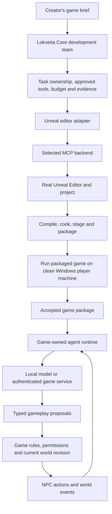

# Lokiravia: build an Unreal game with AI, then run agents inside it

Planning revision: 6 September 2026. This is the owner-requested Unreal and Gameplay AI direction, with source findings and planned qualification work. It is not evidence of an executed Unreal session, game package or NPC runtime.

## Target outcome

A creator describes a game. Lokiravia creates its project, opens the real Unreal Editor, assigns coding and level work to an AI team, tests the result, and produces a Windows package. That package contains NPCs and world systems that can observe, plan, act, and remember during play.

The development agents and the game's agents have separate lifetimes, permissions, budgets, and acceptance tests. Closing Lokiravia must not break the shipped game. A game that needs a local model or an online service must declare that dependency honestly.

## Findings and reuse decision

The requested project is **IvanMurzak/Unreal-MCP**, part of AI Game Developer. At inspected commit `92116403a03c205ddacc2e4ef8d88d99e119cee3`, its descriptor reports version `0.16.0`, beta status, and separate Editor and Runtime modules for Win64, Mac, and Linux. Both this repository and the shared GameDev-MCP-Server identify Apache-2.0 licenses. This does not license Unreal Engine, models, assets, or a hosted provider service. Check those separately before redistribution. [Plugin descriptor](https://github.com/IvanMurzak/Unreal-MCP/blob/92116403a03c205ddacc2e4ef8d88d99e119cee3/UnrealMCP/UnrealMCP.uplugin), [plugin license](https://github.com/IvanMurzak/Unreal-MCP/blob/92116403a03c205ddacc2e4ef8d88d99e119cee3/LICENSE), [server license](https://github.com/IvanMurzak/GameDev-MCP-Server/blob/62a6b7d1cbf98e23a6cd871e72950405e2808b77/LICENSE).

Its documented editor tools cover actors, levels, Blueprint authoring and compilation, assets, C++ editing and compilation, Play-In-Editor, logs, and screenshots. The CLI can create/open projects. The stated floor is UE 5.5; the authors report CI against 5.7 and verification on 5.8. Screenshots require a graphics-capable editor. These are upstream claims, not our compatibility results. The Blueprint surface includes function/event stubs; arbitrary graph-authoring coverage still needs a task-by-task test. [Pinned project README](https://github.com/IvanMurzak/Unreal-MCP/blob/92116403a03c205ddacc2e4ef8d88d99e119cee3/README.md).

The separate GameDev-MCP-Server connects MCP clients to engine plugins using SignalR. It is shared by Unreal, Unity, and Godot. The local server is distinct from the hosted LLM/billing service. Its versions must be paired with the plugin's McpPlugin dependency major; pin the whole chain rather than downloading “latest.” [Pinned server description](https://github.com/IvanMurzak/GameDev-MCP-Server/blob/62a6b7d1cbf98e23a6cd871e72950405e2808b77/README.md).

Runtime support is real source code, not just an editor feature: `UUnrealMcpRuntimeSubsystem` supplies an opt-in connection and an extension surface. The runtime has infrastructure and a system ping; game-specific actions must be registered by the game. It does not supply NPC goals, memory, world simulation, or a model inference service. Connection checks include the runtime enable setting, Shipping policy, and remote-host permission. [Runtime implementation](https://github.com/IvanMurzak/Unreal-MCP/blob/92116403a03c205ddacc2e4ef8d88d99e119cee3/UnrealMCP/Source/UnrealMcpRuntime/Private/UnrealMcpRuntimeSubsystem.cpp).

The inspected build file sets `bUnrealMcpAllowShipping` to false and stages a separate .NET bridge on desktop targets. A shipping integration therefore needs a reviewed packaging/configuration solution; do not promise a configuration-only switch before testing the actual build. Runtime initialization can prepare local IPC before Connect, so “no connection” is not evidence of zero network footprint. [Runtime build rules](https://github.com/IvanMurzak/Unreal-MCP/blob/92116403a03c205ddacc2e4ef8d88d99e119cee3/UnrealMCP/Source/UnrealMcpRuntime/UnrealMcpRuntime.Build.cs), [runtime implementation](https://github.com/IvanMurzak/Unreal-MCP/blob/92116403a03c205ddacc2e4ef8d88d99e119cee3/UnrealMCP/Source/UnrealMcpRuntime/Private/UnrealMcpRuntimeSubsystem.cpp).

Epic's own UE 5.8 **Unreal MCP** is a second candidate. It is Experimental, runs calls serially on the game thread, and has runtime modules that can host a server in cooked/Shipping builds. Its Toolset Registry adapter is editor-only; a packaged game must explicitly register its tools. The documented server has no authentication layer and is intended for local use. This makes it a comparison candidate, not an automatically approved production endpoint. [Epic documentation](https://dev.epicgames.com/documentation/unreal-engine/unreal-mcp-in-unreal-editor).

**Proposed decision:** evaluate IvanMurzak's stack first for the complete editor workflow, and compare Epic's native stack on the same pinned UE version. Reuse working editor operations through a Lokvetia Core adapter. Select the runtime implementation separately after the packaged-game test. Do not build another broad Unreal editor-control layer before this comparison.

The source recheck on 6 September 2026 also confirms a practical discovery requirement: Epic's MCP plugin and its toolsets are separate, and default tool search exposes discovery tools before individual operations. The adapter experiment must retain the discovered toolsets/schemas and exercise the actual actor, level, Blueprint and test operations it needs; an enabled plugin or successful connection is not coverage evidence. [Epic setup and tool discovery](https://dev.epicgames.com/documentation/unreal-engine/unreal-mcp-in-unreal-editor).

## Proposed architecture

This is a Lokiravia proposal. Planning and code preparation may run concurrently, but one editor session has one serialized mutation queue. Two level agents must not write the same map or Blueprint concurrently. Save checkpoints and collect actual tool errors; a model's success message is not build evidence.

For gameplay, expose narrow actions such as `move_to`, `speak`, `accept_job`, and `schedule_world_event`. A response is a proposal containing actor, action, parameters, world revision, expiry, and request ID. The game checks authority, legal state transitions, bounds, and duplicate requests before applying it. Never offer development tools, arbitrary reflection, filesystem writes, or shell commands to an NPC.

NPC planning runs asynchronously and less often than movement/combat. Deterministic game logic handles moment-to-moment behavior and provides a fallback when inference is unavailable. A world director follows the same bounded action contract. In multiplayer, the authoritative server validates decisions; clients cannot mint world changes. Persist accepted events and memory separately from untrusted dialogue. Stale plans are discarded or replanned after save/load and world changes.

Cloud inference uses a game-service identity and per-player/session limits; provider master keys do not enter the executable. Local inference needs an explicit supported model, memory profile, installation story, and offline fallback. MCP is an optional transport for gameplay actions, not the NPC's intelligence or memory system.

## The .exe acceptance boundary

Unreal packaging comprises build, cook, stage, and package operations. A Windows release normally contains an executable and supporting data files; success does not mean a single self-contained file. PIE success and an editor C++ compile are earlier checks, not release acceptance. [Epic packaging documentation](https://dev.epicgames.com/documentation/unreal-engine/packaging-your-project).

The proposed release gate requires the exact packaged artifact to start and finish its reference scenario on a Windows machine without Unreal Editor, Lokiravia or Lokvetia Core, developer credentials, or undeclared tools. Check Development and Shipping separately, collect build logs, artifact hashes, crashes, and gameplay traces, and verify that only intended runtime components ship. Signing, redistribution notices, and store publication are separate release work.

## First reference game and proposed work sequence

Use a small single-player outpost: one level, three NPCs, one resource-delivery objective, and one world event. A guard patrols, a worker moves supplies, and a merchant trades. Removing a supply route makes the worker choose another permitted action; a scheduled storm changes work priorities. The game must remain playable when the model is slow or disconnected.

The rows below are proposed research/delivery slices, not newly claimed catalogue tasks or completed features.

| Order | Deliverable | Acceptance evidence |
| --- | --- | --- |
| 1 | Pin both candidate stacks and identify reuse gaps | Exact engine/plugin/server/toolchain versions, licenses, required hardware, tool inventory, and supported/unsupported operations |
| 2 | Reproduce editor creation and authoring | Open real editor; create/save/reopen a level; generate and compile C++/Blueprint behavior; detect and repair an injected compile error |
| 3 | Produce a Windows package | Build/cook/stage/package; launch it without the editor on a second qualified Windows machine; complete the objective and retain hashes/logs |
| 4 | Define game-owned agent contracts | Typed observations/actions/memory, identity, budgets, cancellation, save/load, multiplayer authority, and invalid/stale/duplicate rejection tests |
| 5 | Prove runtime behavior in Development | Three NPCs and a world director react to changed conditions through actual model calls; trace decisions and measure latency, cost and frame time |
| 6 | Prove Shipping and recovery | Same scenario in the Shipping package; no development tools or provider keys; disconnect, restart, timeout, malformed output, budget exhaustion and offline fallback pass |
| 7 | Review and decide | Repeat on clean qualified workers, compare candidates, record measured limits and explicit go/no-go for this narrow use case |

Initial proposed measurements: a 30-minute play session, ten save/load cycles, a five-minute model outage, and twenty sequential agent decisions. Record actual p50/p95 decision latency, model calls/tokens, memory, package size, startup/build time, frame-time change, rejected actions, and recovery outcomes. Agree final thresholds against the chosen hardware before advertising support. These numbers define a proposed experiment, not results.

For the first complete vertical slice, keep one evidence bundle containing the brief and declared starter assets, agent/tool trace with manual interventions, accepted source revision, Development and Shipping build receipts, exact player-package hashes, objective-completion trace, and NPC decision/save/load/outage results. Finish by asking for one small gameplay change and producing a second accepted package without losing the original playable build. Until that loop passes, report the accepted component or partial scenario rather than the complete AI game-factory promise. The source findings above describe published capabilities. The evidence bundle must separately record what was actually exercised in Lokiravia.

## Backlog and repository placement

Existing `AF-CLD-054` already owns Unreal feasibility and qualification, depends on `AF-CLD-052`, and sits in M5. This user-requested early desk study feeds it; it does not bypass those delivery dependencies or mark it done. `AF-CLD-005` remains the shared engine/target/pack consumer proposal. `AF-CLD-006` supplies the separate evidence gates.

AF-CLD-054 now links this plan and distinguishes editor qualification from the full gameplay-AI claim. The gameplay contracts and implementations below remain separate delivery slices that need narrow upstream claims before implementation; publishing this plan does not create or complete those capabilities. Put reusable adapter/runtime APIs in Core outside its neutral scheduler, product setup/billing/qualification in Cloud, and game-specific tools in the game pack. A separate plugin repository is justified only after the experiment identifies an independently released Unreal module; this research does not create one pre-emptively.

Open questions for the experiment: arbitrary Blueprint graph coverage, runtime sidecar deployment in Shipping, supported exact Unreal/compiler combination, provider/model availability on the player machine, actual inference cost, and reliable packaging without manual editor intervention. No Unreal support claim should be made until these are measured.

## Delivery slices for the full use case

This is the delivery map for the full use case. The labels below are planning labels under this design, not new task IDs or active implementation claims. Keep the existing Unreal feasibility task and its prerequisites. Review the shared contracts first, then allow narrow implementation tasks to run in parallel.

| Slice | Depends on | Main home | Done means |
| --- | --- | --- | --- |
| A. Reproducible Unreal test setup | Existing engine qualification prerequisites | Cloud qualification docs; reusable probes in Core | Record the engine, compiler, plugin, server, model and machine versions. A fresh test workspace can open the pinned project. Missing access or hardware is reported as a limitation. |
| B. Development and gameplay contracts | A's capability inventory | Core | Define separate editor jobs and gameplay observations/actions, including fenced editor ownership, retry rules, artifact provenance, session/save epochs, cancellation, permissions and evidence. Neither contract creates a second task scheduler. |
| C. Editor adapter | A, B | Core | Agents create, save and reopen the test level; edit and compile behavior; recover from one injected compile error. Logs and project changes prove the result. |
| D. Build and player test | C | Core build adapter; Cloud artifact presentation | Package the exact project revision and complete the objective on a separate Windows player machine. Keep the package hash, logs and play trace. |
| E. Game-owned NPC runtime | B | Core reusable runtime contracts; Unreal game pack | Three NPCs make actual model-assisted decisions through allowed game actions. Invalid, duplicate and stale actions are rejected. Engine movement and combat stay responsive. |
| F. Memory and world events | E | Game pack using reusable Core contracts | NPC memory survives save/load. A blocked route changes a permitted plan. One world event changes priorities without violating the quest rules. |
| G. Runtime service and limits | B; integrate with E | Core provider adapter; Cloud service if needed | Declare local or hosted inference requirements, enforce measured limits, cancel abandoned requests and use fallback behavior during an outage. No provider master key enters the game package. |
| H. Full release and creator trial | D, F, G | Cloud qualification and creator flow | The Shipping package passes the reference scenario and recovery tests. A creator can describe, inspect, play, request a change and export without handling editor internals. |

C and E can proceed independently after B is accepted. G can also start from B, using a declared test double before real service qualification. Test doubles do not satisfy E, G or H's live acceptance. D must not wait for every future NPC feature: prove a normal game package first, then repeat the player test with the runtime included.

Do not reserve all engine or UI files under one large Unreal claim. Declare exact paths and the editor session as a shared resource. Binary maps and assets need an explicit single-writer policy; Git branches alone do not resolve simultaneous edits to the same Unreal asset. A reviewer inspects the resulting game behavior as well as the source diff.

## What the first experiment must distinguish

- **Created by the AI team:** retain the original brief, generated changes, tool calls, failed attempts and any manual intervention. Starting from a template is acceptable when its contents are declared. A manually repaired demo is not evidence of a fully autonomous run.
- **Working game:** the packaged build must complete the objective through player inputs. A screenshot, a successful compile or a running process is insufficient by itself.
- **Agentic behavior:** change an observation and trace the model's selected permitted action, its validation and its effect on the world. Dialogue alone does not prove autonomous world behavior. Also run the same scenario with the model disabled to expose the fallback boundary.
- **Persistent world:** for the first single-player experiment, persistence means saved state and bounded catch-up after loading. Running NPCs while the game is closed would require a separate always-on service and is outside this experiment.
- **Reproducible result:** repeat the same build on a clean qualified worker and the same player scenario from a known save. Record variability rather than selecting only a successful run.

If the editor adapter succeeds but Shipping runtime support fails, retain the useful editor integration and test another gameplay runtime. If gameplay AI breaks frame time or exceeds the agreed budget, reduce the decision rate and active NPC count before scaling. A failed small scenario is a signal to fix the boundary, not to start a larger world.

The three development PCs can contribute different test evidence after their actual capabilities are checked. One qualified Windows worker can host the editor and packaging; the second can test the packaged game in an isolated player environment; Ubuntu can test portable contracts and any hosted service. These are suggested lab roles, not task assignments or proof that the required software is already installed.

## Contract and experiment refinements

These are proposed acceptance requirements from a second document review. They are not capabilities already verified in Lokiravia or the candidate plugins.

1. **Recover editor ownership safely.** Reuse Core worker ownership to bind each editor session to a project, workspace, lease and fencing token. Give commands stable IDs. After a timeout or coordinator restart, inspect whether an asset was created before retrying it. An expired worker must not continue changing the project after ownership transfers. A queue inside one process does not coordinate three computers by itself.
2. **Measure three kinds of repeatability separately.** Repeat generation from a brief and record variation and manual help. Rebuild an accepted source revision with locked assets and dependencies. Replay a player scenario from a known save. Bind each package receipt to source, assets, engine, compiler, plugins, build configuration and output hashes. Do not require identical prompts to produce identical games, or claim byte-identical builds without testing that property.
3. **Choose what ships.** Compare an editor-only MCP setup with a deliberately enabled gameplay MCP setup. A game-owned runtime can use another transport. Inspect staged files, processes and listeners as well as connection status; a disconnected component may still be present. The player environment must have no inherited developer credentials, source checkout, editor or undeclared model service. Record its GPU, driver and installed prerequisites. A second developer PC qualifies only when its player environment is isolated accordingly.
4. **Partition assets and test the combined project.** Declare referenced maps, Blueprints, materials and generated metadata that a task can change. Use separate content areas where practical, with one owner for integration. Reopen and cook the combined project before accepting a merge. Passing each branch's tests does not prove that their asset references work together.
5. **Discard decisions from an old game session.** Include a session/save epoch and actor generation in the action contract. Loading a save, destroying an NPC or ending a session invalidates its outstanding decisions. Define whether pending intentions are saved and bound any simulation catch-up. Test replies arriving after load, cancellation and reconnect, including duplicate delivery.
6. **Keep memory within game rules.** Give memory records an owner, source and size/retention limit. Player speech, NPC dialogue and retrieved memories cannot grant permissions or change the action contract. Test attempts to expose another NPC's private memory or bypass quest rules. A valid response schema alone does not authorize an action. New executable skills inspired by Voyager require development-time validation and versioned release; dialogue cannot install new game code during play.
7. **Set pass criteria before comparing candidates.** Agree objective completion, repair-attempt, latency, frame-time, cost and recovery limits against the chosen hardware. Retain failures as well as successes. Compare deterministic fallback, model-assisted play and a deliberately failing provider on the same scenario. Twenty decisions can prove an observable path; their p95 is a small pilot statistic, not a service guarantee. State what model assistance actually improved.

Editor ownership, build provenance and session/save semantics belong in slice B before C, E and G implement their shared boundaries. This preserves useful parallel development without letting each component invent a different recovery model.

## Proposed catalogue revision

Keep the first Godot release and its existing dependencies. This revision extends AF-CLD-054 with editor/build evidence and the conditional full-use-case gate. Register the separate upstream gameplay-AI delivery tasks after their contracts and exact scopes are reviewed. The table below maps the delivery gaps to existing work and the needed follow-ups. It does not allocate new IDs or change completed-task acceptance.

| Gap | Smallest catalogue change | Owner and dependency |
| --- | --- | --- |
| AI authoring in the real editor | Extend `AF-CLD-054` with create/open/save/reopen, C++/Blueprint authoring and compile-error recovery; compare pinned MCP candidates. Add a narrow upstream editor ownership/adapter requirement. | Core provides the adapter contract. Cloud qualifies the use case. Preserve `054`'s prerequisite `052`. |
| A real Windows Shipping game | Extend `054`'s evidence to separate editor compile, PIE, Development and Shipping; require the objective on an isolated player machine and exact artifact provenance. | Core provides build receipts. Cloud qualifies the artifact using the `006` evidence vocabulary and `032` export rules. Do not treat the first Godot export under `016` as Unreal evidence. |
| Gameplay-agent actions | Register a separate requirement for typed observations and allowed action proposals, actor authority, request/world/session identities, expiry and rejection of invalid or old actions. | Core owns the reusable contract. It precedes NPC and gameplay-service implementations; Cloud records the accepted Core version through `003`. |
| Memory and world behavior | Register the small game pack: three NPCs, one objective, one world event, route changes, saved memory, delayed-reply rejection and deterministic fallback. | Game-specific behavior belongs in the pack, using Core runtime contracts. It can proceed independently of editor work once those contracts are accepted. |
| Inference while playing | Register supported local/hosted runtime profiles with measured frame-time impact, asynchronous decisions, cancellation, session budgets and actual effective-model evidence. | Core owns the runtime/provider boundary. Optional Cloud services reuse `027/028/029` for connections, credentials and usage. Development authorization does not silently fund player inference. |
| The complete creator journey | Register a conditional acceptance item from brief through AI authoring, package, player objective, observable NPC actions, feedback and a revised package. Retain failed attempts and manual help. | Cloud combines qualified `054` and gameplay runtime evidence. Reflect the supported scope under `060/067`; this optional path does not block the first Godot release. |

Allocate new stable IDs only in that reviewed revision, update the existing shared registry and cross-repository integration map together, and keep one task authority. Previously completed contracts need explicit follow-up changes; their old test results cannot certify a newly added requirement.

## Creator trial and scope of the first result

After technical qualification, run a small observed trial with novice creators. First use adults unfamiliar with Unreal to find basic interface problems. A later 12+ trial requires the accepted access and participant arrangements; an adult trial does not certify usability or eligibility for children.

Give each participant the same five tasks: describe a small game, understand and resolve one supported setup step, play the latest accepted build, request one gameplay change, and export and play the revised package. Record completion without facilitator intervention, wrong turns, blocked steps, active user time, build waiting time and whether the participant can explain the next step. Preserve the first playable build throughout the change. Set the participant count, time limits and acceptable completion rate before recruitment; this document does not report a completed user test.

Before the technical comparison, write a scenario checklist that a reviewer can execute independently of the generating agent: complete the delivery objective through player input, observe the three declared NPC roles, change the supply route, trigger the world event, save and reload, then repeat with inference unavailable. Bind the review to the tested package hash and keep failures and manual repairs in the evidence bundle. Decide pass limits before running the candidates.

This first result covers the declared single-player scenario. It does not qualify voice or lip-sync, multiplayer, NPC simulation while the game is closed, runtime installation of generated code, a large persistent city, or a public commercial release. Each needs its own task and evidence. These limits preserve the larger product direction while keeping the initial result testable.
